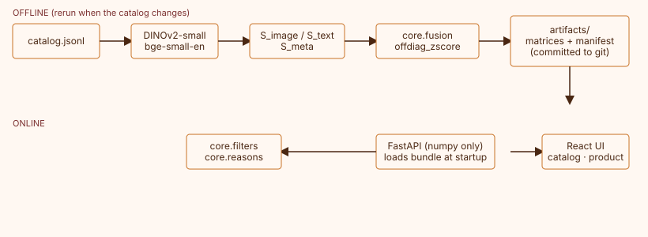

# Similar pieces — a prototype for Ashiana

A content-based "similar products" recommender for Ashiana, a handcrafted ethnic jewelry
brand. Built for a cold-start catalog with no click or purchase history: every
recommendation comes from three independent content signals — product photography, an
LLM-grounded text descriptor, and structured metadata — combined by a weighted fusion the
shopper can actually see and adjust.

**Live:**
- UI: [ashiana-recs-ui.onrender.com](https://ashiana-recs-ui.onrender.com)
- API: [ashiana-recs-api.onrender.com](https://ashiana-recs-api.onrender.com) ([`/docs`](https://ashiana-recs-api.onrender.com/docs))

> **Product photos don't appear on the live deployment, on purpose.** There's no written
> permission from Ashiana to redistribute their product photography, and this is a public
> submission, so `artifacts/thumbs/` is deliberately gitignored and never published (see
> [D3 in DECISIONS.md](docs/DECISIONS.md)). Everything else — ranking, category fallback,
> weight fusion, the evaluation numbers below, the API itself — is real and running against
> the actual 472-product catalog. The [demo video](#demo-video) is recorded locally, where
> the images do exist, specifically so it can show the real shopper experience.

Free-tier hosting sleeps after inactivity — the first request after a while can take about
a minute to wake up. The UI shows a banner while it waits.

## Architecture



**Offline** (rerun only when the catalog changes): DINOv2-small embeds each product's
packshot, bge-small-en-v1.5 embeds an LLM-grounded text descriptor, and a Gower-style
metric compares structured metadata (collection, materials, stones, price). Each signal's
N×N cosine similarity matrix is z-scored over its off-diagonal entries and written, along
with the catalog and a version manifest, to `artifacts/` — committed to git.

**Online**: the API loads that bundle once at startup (no model runs at request time — it's
a weighted sum of three precomputed matrices) and serves ranking, category filtering, and
human-readable reasons. The React UI is a static site in front of it.

## How it works

- **Signals.** Image cosine (DINOv2), text cosine (bge on an LLM-extracted, grounded design
  descriptor — never the raw scraped copy), and metadata similarity (Gower-style, missing
  fields renormalized out rather than guessed).
- **Fusion.** `score = w_image·Z_image + w_text·Z_text + w_meta·Z_meta`, where each `Z` is
  the signal's similarity z-scored over its off-diagonal entries first — raw cosines from
  different signals sit at different centers and spreads, so combining them unscaled would
  let whichever one runs "hotter" dominate regardless of its actual weight. Weights are
  adjustable per request (the product page's inspector sliders) and tuned by default via a
  grid search that picks a flat region of the weight simplex, not the single best point,
  so the default isn't overfit to the 25 labeled evaluation queries.
- **Category rule.** Hard-filtered to the same product type by default (a ring's "similar
  pieces" are always other rings). If fewer than `k` same-type candidates exist, the list
  backfills from related types (ranked by a taxonomy similarity table, then score),
  flagged `fallback: true` so the UI can say so.
- **"Similar" means substitutes**, not complements — never "complete the look."

## Evaluation

25 stratified queries, 595 hand-labeled query/candidate pairs (`docs/LABELING_GUIDE.md`),
graded relevance (0/1/2), NDCG@5 and P@5 with 95% bootstrap CIs (1000 resamples). Full
methodology, ablations, proxies (coverage, hubness, cross-signal agreement, price sanity),
and failure cases are in [`artifacts/eval/report.json`](artifacts/eval/report.json) and the
[notebook](notebooks/ashiana_similar_products.ipynb).

| Method | NDCG@5 [95% CI] | P@5 [95% CI] |
|---|---|---|
| **fused, tuned weights (0.6 / 0.1 / 0.3)** | **0.819** [0.682, 0.935] | 0.648 [0.512, 0.776] |
| fused, default weights | 0.766 [0.632, 0.883] | 0.656 [0.520, 0.784] |
| image only | 0.819 [0.685, 0.931] | 0.632 [0.504, 0.760] |
| text only | 0.641 [0.502, 0.772] | 0.512 [0.384, 0.640] |
| metadata only | 0.563 [0.438, 0.688] | 0.400 [0.296, 0.512] |
| same-type + nearest-price baseline | 0.618 [0.485, 0.738] | 0.376 [0.272, 0.496] |
| random within type | 0.351 [0.239, 0.473] | 0.217 [0.117, 0.328] |

Fused beats the same-type + nearest-price baseline on NDCG@5. Reported plainly rather than
papered over: `image_only` alone is statistically indistinguishable from the fully tuned
fusion — on a catalog this visually consistent (studio packshots, similar framing), DINOv2
is carrying most of the substitutability signal, and text/metadata add real but smaller
value on top of it. With only 25 queries every number above carries a wide CI; the results
support "fused beats both baselines and image dominates" as a directional finding, not
fine-grained claims between methods whose intervals overlap.

**Hubness.** Mean in-degree 5.0 (skewness 1.55) across the full 472-product catalog — a
handful of generically-appealing pieces (e.g. "Ashiana Red flower Chandbali for Women",
appearing in 29 other products' top-5 lists) get recommended disproportionately often.
Coverage is 93.2% (440/472 products appear in at least one top-5).

**Failure cases.** The 5 lowest-NDCG queries all sit in thin catalog slices (brooches,
hair accessories) or seasonal/novelty framing ("Diwali Special…") the taxonomy doesn't
capture — full detail, with the actual candidate lists, is in the notebook's §7.

**Model and bundle versions**: DINOv2 (`facebook/dinov2-small`), bge
(`BAAI/bge-small-en-v1.5`), LLM descriptor extraction (`openai/gpt-oss-20b` via Groq) —
current bundle version and exact weights are always available live at
[`/version`](https://ashiana-recs-api.onrender.com/version); the full report is at
[`/eval/report`](https://ashiana-recs-api.onrender.com/eval/report).

## Design decisions

The full log — every non-trivial choice, why, and what was considered instead — is in
[`docs/DECISIONS.md`](docs/DECISIONS.md). Five worth reading first:

1. **[Image rights (D3)](docs/DECISIONS.md).** No written permission to redistribute
   Ashiana's product photography, so it's gitignored throughout — including from the live
   deployment, decided explicitly rather than left ambiguous once a working deploy made it
   tempting to just commit the thumbnails and move on.
2. **[LLM provider pivot to Groq (D4)](docs/DECISIONS.md).** Gemini's free tier caps at 20
   requests/day on every model tried — confirmed from the API's own quota error, not
   assumed — so the project switched to Groq, one of the roadmap's own pre-approved
   options, rather than stalling on a vendor limit outside the project's control.
3. **[Flat-region weight tuning](docs/DECISIONS.md).** The default fusion weights are
   chosen as the centroid of grid points within one standard error of the best point, not
   the single best point — a leave-one-query-out check confirms this doesn't overfit to
   the 25-query label set the way picking the literal best grid cell would risk.
4. **[The D6 design redo](docs/DECISIONS.md).** The first visual direction (dark ground,
   jewel-tone accents) was built, reviewed live, and rejected as not matching what was
   wanted — the response was fresh research (the real Ashiana storefront's actual colors
   and structure, sampled directly) and a new two-pass proposal, not a re-skin of the
   rejected version.
5. **[Production deploy debugging](docs/DECISIONS.md).** Three real deploy failures (an
   invalid Render Blueprint field, a build-breaking symlink, a 500-vs-404 bug in static
   file serving) were each root-caused by reproducing the actual failure locally or reading
   the actual error, not by guessing and iterating blindly against the live deploy.

## Limitations

- **No product images on the live deployment** — see the callout at the top. This is the
  single biggest gap between the live demo and the full experience; the video and local
  setup below both show the real thing.
- **Small evaluation set.** 25 labeled queries means wide confidence intervals throughout
  (see Evaluation above) — treat method comparisons as directional, not precise.
- **Thin categories.** Brooches, home decor, bangle/bracelets, and rings each have only
  9–10 products in the catalog — barely enough to avoid the category-fallback rule, and
  the lowest-scoring evaluation queries skew toward exactly these categories.
- **Single photo per product.** Every scraped product had exactly one image, so the
  packshot-selection heuristic in `pipeline/images.py` never actually had to choose between
  alternatives — it's exercised in the "is this one photo usable" sense only.
- **Pooled-IR labeling bias.** Only candidates that appeared in one of six methods' top-8
  during label-pool construction were ever hand-labeled; anything else scores as
  relevance-0 by convention (standard pooled-IR evaluation), not as a confirmed miss.

**What changes at 10k+ items** (today's catalog is 472 products; none of this is
implemented, it's the honest answer to what would break first):
- Store each item's top-k neighbors per signal instead of full N×N matrices.
- A weighted sum of cosines is exactly a plain dot product over per-signal vectors
  pre-scaled by √weight and concatenated — that's what would make an ANN index usable at
  all, since ANN libraries index under one fixed distance metric, not a runtime-adjustable
  weighted sum of three.
- ANN only starts to matter around 100k+ items; below that, exact search over precomputed
  matrices (today's approach) is both fast enough and exactly correct. The category hard
  filter also turns into a filtered/hybrid ANN search problem, not just an index swap.
- New items need incremental indexing, and a policy for how stale neighbor lists are
  allowed to get between rebuilds.
- Once real click data exists, the honest move is to blend it with these content signals
  (e.g. as re-ranker features, or as the fallback for genuinely new items), not to replace
  content-based fusion outright — it's what makes cold start work at all.

Full reasoning for all of the above is in the
[notebook](notebooks/ashiana_similar_products.ipynb), §7–§8.

## Local setup

```bash
make setup   # venv (Python 3.11) + pinned requirements-pipeline.txt + Playwright's Chromium
make build   # runs the offline pipeline end-to-end -> artifacts/ (uses the committed
             # LLM cache; zero API calls needed, see docs/DECISIONS.md)
make eval    # pipeline/evaluate.py -> artifacts/eval/report.json + figures
make api     # uvicorn api.app.main:app --reload, http://localhost:8000
make ui      # cd frontend && npm run dev, http://localhost:5173 (real product images,
             # since artifacts/thumbs/ exists locally once make build has run)
```

`api/requirements.txt` is deliberately separate from `requirements-pipeline.txt` and never
imports `torch`/`transformers`/`sentence_transformers` — enforced by a test
(`tests/api/test_no_heavy_deps.py`), not just a convention.

## Repo map

```
api/            FastAPI service — numpy only, no ML deps (rule 5)
core/           Ranking logic: fusion, category filters, reason generation.
                Numpy-only, imported by both api/ and pipeline/ — never reimplemented
                in either.
pipeline/       Offline pipeline: ingest, clean, image/text encoding, metadata
                similarity, evaluation. Writes artifacts/.
frontend/       React + Vite + TypeScript UI (catalog, product page + inspector,
                dev-only /label tool).
artifacts/      Committed pipeline output: matrices, catalog, manifest, eval report
                and figures. Product images (artifacts/thumbs/) are gitignored — see
                Limitations.
config/         settings.yaml (tunables) and taxonomy.yaml (type/collection/material
                similarity tables).
data/           Canonical catalog (data/catalog.jsonl). Raw scrape snapshot and
                downloaded images are gitignored.
docs/           DECISIONS.md (full decision log), DESIGN.md (D6 visual design),
                LABELING_GUIDE.md, architecture.svg.
labels/         Hand-labeled relevance judgments (labels/relevance_labels.json).
notebooks/      Design/evaluation notebook — runs top-to-bottom on a fresh Colab
                runtime with no secrets required.
tests/          core/, api/, and light pipeline tests.
render.yaml     Render Blueprint for the live deployment.
```

## Data and image attribution

Catalog data (titles, prices, categories, descriptions) was scraped from Ashiana's public
storefront, [ashianayouronestopshop.com](https://www.ashianayouronestopshop.com), for this
educational project. Product photography is **not** reproduced anywhere in this repo or its
live deployment — see [Limitations](#limitations) and [D3](docs/DECISIONS.md) above. This
is an independent, unofficial prototype, not affiliated with or endorsed by Ashiana.

## Demo video

_Coming soon — recorded locally against `make api && make ui`, so it can show the real
product photography the live deployment deliberately omits. Script in `ROADMAP.md` §14._
